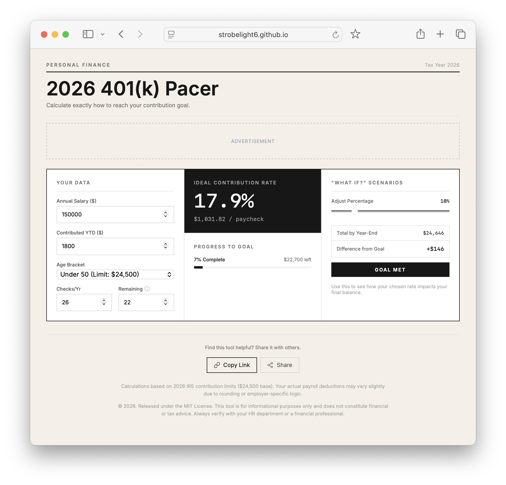

# 401k Calculator

A clean, editorial-styled retirement savings calculator.

Enter your salary, year-to-date contributions, age bracket, and pay schedule to see the exact contribution rate and per-paycheck amount needed to hit the 2026 IRS limit. Includes a "what-if" slider to preview how any chosen rate affects your year-end total.

**Live:** https://strobelight6.github.io/401kCalculator/

